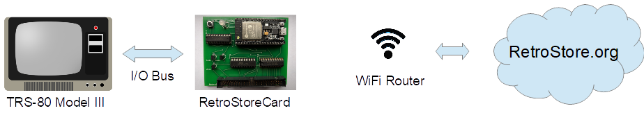

# RetroStoreCard

The RetroStoreCard connects a TRS-80 Model III to the <a href="https://retrostore.org">RetroStore</a>.
The <a href="https://retrostore.org">RetroStore</a> hosts applications for the Tandy Radio Shack vintage computers
and allows to seamlessly download and run these applications without the need of cassettes or floppy disks. The
following sections give an overview of the RetroStoreCard as well as how to connect and configure it. This Github
repository contains the complete source code as well as the Fritzing diagram for the PCB (Printed Circuit Board).
For the following descriptions it is assumed that an assembled RetroStoreCard is available.

### Overview

The figure below depicts the overall architecture. The TRS-80 machine is connected to the RetroStoreCard via the I/O Bus.
The RetroStoreCard has a WiFi module that connects to the local WiFi router. This allows the RetroStoreCard to connect
to the RetroStore backend that is hosted in the cloud. The TRS-80 machine runs a local client (written for the Z80 CPU) that
communicates via the I/O Bus with the RetroStoreCard which in turn uses the regular HTTP protocol to access the RetroStore
backend server.




### Prerequisites

The RetroStoreCard requires a TRS-80 Model III with 48 kB of RAM. Floppy disk drives or a cassette tape are not required.
Note that the current version of the RetroStoreCard does not work with the TRS-80 Model I.


### Connecting the RetroStoreCard

The following figure shows the top view of the RetroStoreCard:


1. Push button
2. Multi-color status LED
3. Red LED power indicator
4. Micro-USB connector
5. TRS-80 I/O Bus connector

The RetroStoreCard needs to be connected to the TRS-80 Model III's I/O Bus via a 50-pin ribbon cable (5). Furthermore,
the RetroStoreCard needs a separate power supply via a standard 5V USB charger. The micro-USB connector (4) plugs into the
side of the RetroStoreCard. A small red LED will indicate when a power supply is connected (3). The push button (1) and the
multi-color status LED (2) will be explained in the next section.

Note: although it is possible to connect multiple cards to the TRS-80's I/O Bus, not all cards are compatible.
In particular, the popular FreHD hard disk emulator is not a good citizen on the I/O Bus as it takes over complete
control. It is therefore not possible to connect both FreHD and the RetroStoreCard at the same time to I/O Bus. Future
versions of FreHD will hopefully remedy this.


### Configuring the RetroStoreCard

The core of the RetroStoreCard is an ESP32 microcontroller that features a WiFi module that is used to connect
to the WiFi router. After physically connecting the RetroStoreCard to a TRS-80 Model III as explained in the
previous section, the WiFi module on the ESP32 microcontroller first needs to be be configured with
the credentials of the local WiFi network.

While in setup mode, the RetroStoreCard's status LED will continuously blink in white to indicate that it has not yet been
configured. While in that mode, the RetroStoreCard will create an open access point called "RetroStoreCard". Use a laptop
to connect to this WiFi network and then use a browser to visit URL <a href="rsc.local">rsc.local</a>. That web page can
be used to configure SSID and password of the WiFi network that the RetroStoreCard should connect to. For open networks
leave the password field empty. Note that the RetroStoreCard cannot connect to WiFi networks that use a capture portal.

Once SSID and password are provided, click on submit to upload the credentials. The RetroStoreCard will automatically
reboot and try to connect to the specified WiFi network. If  successful, the LED will turn green for a few seconds. If
the credentials are wrong or if the specified WiFi network is not accessible, the LED light will turn permanently red.
Note that the RetroStoreCard will store the WiFi credentials, so the configuration only needs to be performed once.
Holding down the push button for three seconds will erase those credentials and place the RetroStoreCard back into
configuration mode (status LED flashing white). This might be necessary if the RetroStoreCard is moved to a different
WiFi network.

The status LED indicates the state of the RetroStoreCard:

* Blinking white: RetroStoreCard is not configured. It will create an open WiFi access point named "RetroStoreCard"
* Solid green: when the RetroStoreCard has been configured with WiFi credentials and the RetroStoreCard was able
  to connect to the WiFi network, the status LED will light in solid green for several seconds.
* Solid red: the RetroStoreCard was configured with WiFi credentials but it was not possible to connect to the specified
  network. The reason could be wrong credentials or the specified network is itself offline. The push button can be
  used to reset the RetroStoreCard into setup mode in case different credentials need to be provided.
* Solid blue: the RetroStoreCard performs an OTA (Over-the-Air) update. The RetroStoreCard will automatically detect
  newer firmware versions and will download and install the new firmware. The status LED will light solid blue during
  this process.
* Off: the status LED will be off during regular operations when the RetroStoreCard is connected to the specified
  WiFi network and ready to accept commands from the TRS-80 Model III.
 
 ### Launching the native RetroStore Client
 
 Once the RetroStoreCard is connected and configured, it is ready for use. The next step is to run a program
 on the TRS-80 that interfaces with the RetroStoreCard. This program is available as a regular
 <a href="https://github.com/apuder/tpk/raw/master/src/main/resources/apps/rsclient/RSCLIENT.CMD">CMD</a> executable.
 For TRS-80 machines with attached physical floppy disks, this CMD executable can be copied to a floppy disk
 and launched the usual way. For TRS-80 machines that have neither floppy disk drives nor cassette tapes, it
 is also possible to bootstrap the native client via the following short BASIC program:
 
 ```BASIC
 10 OUT236,56
 20 OUT31,0
 30 FOR X=0TO100:POKE17152+X,INP(31):NEXT
 RUN
 SYSTEM
 *? /17152
 ```
 
 The above BASIC program will download the CMD executable from the RetroStoreCard and launch the native client.
 Note that this procedure needs to be repeated every time the TRS-80 is turned on.
 
 ### Using the native RetroStore Client
 
 After successfully launching the native RetroStore client, the monitor of the TRS-80 should look like this:
 
 
 
 The screenshot above shows the main menu of the native RetroStore client. The arrow indicates the currently selected menu item.
 The up and down cursor keys can be used to move between the various menu items. Hitting the ENTER key will activate the currently
 selected menu item. Pressing CLEAR or BREAK in sub-menus will return to the previous menu.
 
 Keyboard controls:
 
 * Cursor up/down: toggle menu selection
 * ENTER: select current menu selection
 * BREAK/CLEAR: exit to previous screen
 