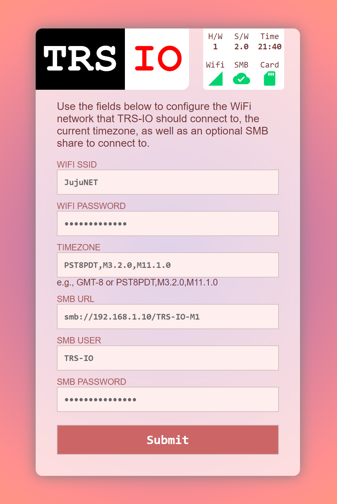

# TRS-IO

TRS-IO gives a TRS-80 Model 1/III online capabilities and provides
access to a variety of services. TRS-IO currently features the
following capabilities:

1. Access to the <a href="https://retrostore.org">RetroStore</a>
2. <a href="http://frehd.com">FreHD</a> emulation
3. Access to files mounted on a SMB share or located on a micro-SD card
4. Access to remote servers via TCP
5. Virtual printer support

The TRS-IO versions for the Model 1 and Model III have some additional features that
are explained below. The following sections give an overview of TRS-IO as well as setup
instructions. This Github repository contains the complete source code
as well as the KiCad schematics for the PCB (Printed Circuit Board).
For the following descriptions it is assumed that an assembled TRS-IO
card is available.

### Overview

The figure below depicts the overall architecture. The TRS-80 machine
is connected to TRS-IO via the I/O bus.  TRS-IO has a WiFi module that
connects to the local WiFi router. This allows TRS-IO to connect to
the Internet and access various services. Note that TRS-IO can only
connect to a 2.4 GHz WiFi network. It is recommended to use an IPEX
antenna to improve WiFi reception.


### Prerequisites

TRS-IO requires a TRS-80 Model III with 48kB of RAM or a Model 1 with 16kB of RAM.
Floppy disk drives or a cassette tape are not required.


### Power Supply

There are two versions of TRS-IO that are tailored to the Model 1 and Model III. Each version makes use of an ESP32 microcontroller
as well as a Tang Nano 9K FPGA. Both the ESP32 microcontroller as well as the Nano 9K need to be powered. There are two ways of doing
this.

* Power each module independently via two USB cables that connect to the ESP32's micro-USB and the Nano 9K's USB-C connector.
  For this option, the "VU" jumper (mentioned below), <b>SHOULD NOT BE USED</b>.
* Power the ESP32 via the Nano 9K or vice versa. For this option, only one of the modules need to be provided with power. This option
  requires the "VU" jumper.
  
In the following, each variant of TRS-IO is explained in detail.

### TRS-IO for the Model III

The following figure shows the top view of the TRS-IO card for the Model III:


1. 50-pin I/O bus connector
2. High resolution graphics connector
3. 3.5mm audio jack
4. VU jumper
5. HDMI connector
6. Micro-SD card reader
7. Multi-color status LED
8. Micro-USB and USB-C connector
9. Status button

The TRS-IO card needs to be connected to the TRS-80 Model III's I/O
bus via a 50-pin ribbon cable (1). Furthermore, the TRS-IO card needs
a separate power supply via a standard 5V USB charger. Please refer
to the previous section regarding the power supply. The status button
(9) and the multi-color status LED (7) will be explained in the
configuration section. The micro-SD card reader is underneath the
Nano 9K module (6). The 3.5mm audio jack (3) can be connected to a standard
speaker for game sound and Orchestra 90 support. If the high resolution
connectors (2) are connected to the TRS-80, the HDMI connector (5) will
generate a video signal.


### TRS-IO for the Model 1

The following figure shows the top view of the TRS-IO card for the Model 1:


1. 40-pin I/O bus connector
2. Micro-SD card reader
3. HDMI connector
4. Micro-USB and USB-C connector
5. Multi-color status LED
6. Status button
7. VU jumper

The TRS-IO version for the Model 1 features a 40-pin connector that can
directly be connected via a ribbon cable to the I/O bus of a Model 1.
This version of TRS-IO offers the following features:

* HDMI signal of the M1's video screen that includes game sound.
* Upper 32kB RAM (emulated by the Nano 9K FPGA) for a total of 48kB of total RAM.
* 25ms heartbeat timer to trigger the realtime clock.
* FreHD auto-boot for an unmodified M1.

The HDMI connector (3) can be used instead of a CRT monitor. TRS-IO for the M1
also emulates the LE18 graphics cards. The color of the HDMI signal can
be set to white (X=0), green (X=1), and amber (X=2) via the following OUT statements:

```OUT 31,0:OUT 31,5:OUT 31,X```

Please refer to an earlier section on how to provide power to TRS-IO.


### Configuring TRS-IO

The core of the TRS-IO card is an ESP32 microcontroller that features
a WiFi module that is used to connect to a WiFi router. After
physically connecting the TRS-IO card to a TRS-80 Model 1/III as
explained in the previous sections, the WiFi module on the ESP32
microcontroller first needs to be be configured with the credentials
of the local WiFi network.

While in setup mode, the TRS-IO's status LED will continuously blink
in white to indicate that it has not yet been configured. While in
that mode, TRS-IO will create an open access point called
"TRS-IO". Use a laptop to connect to this WiFi network and then use a
browser to visit URL <a
href="http://trs-io.local">trs-io.local</a>. The following web page
should appear in the browser:



Some hosts do not correctly handle mDNS that is used to resolve <a
href="http://trs-io.local">trs-io.local</a>. In that case, visit the
IP address <a href="http://192.168.4.1">192.168.4.1</a> instead.
The web interface shown above can be used to configure SSID and password of the WiFi
network that TRS-IO should connect to, the local timezone as well as
the credentials of a SMB share. For open networks leave the WiFi
password field empty. Note that TRS-IO cannot connect to WiFi networks
that use a capture portal. The timezone as well as the SMB share are
not required but will result in limited functionality.

Once all the information is provided, click on submit to upload the
parameters. TRS-IO will automatically reboot and try to connect to the
specified WiFi network. If successful, the LED will turn green for a
few seconds. If the credentials are wrong or if the specified WiFi
network is not accessible, the LED light will turn permanently red.

Note that TRS-IO will store all parameters in its local flash memory,
so the setup only needs to be performed once. Once TRS-IO is connected
to a WiFi router, it should still be possible to access URL <a
href="http://trs-io.local">trs-io.local</a> from a browser on the same
WiFi network. If mDNS is not supported by the host, the following BASIC
program can be used to determine TRS-IO's local IP address that was
assigned by the router:

```
10 OUT 236,16
20 OUT31,0:OUT31,4
30 C=INP(31):IF C=0 THEN END
40 PRINT CHR$(C);
50 GOTO 30
```

The web interface will also display two icons to indicate the status
of the SMB share and the micro-SD card (see screenshot above). Green
icons indicate that TRS-IO has access. Red icons indicate an error.
In that case, hovering the mouse over the red icon will display the
error message. It should be noted that TRS-IO needs to be rebooted
whenever a micro-SD card is inserted or ejected.

Pushing the status button will make the LED flash twice. The first time for
the WiFi status (green: WiFi connected; red: WiFi not connected) and a
second time for the SMB status (green: connected to SMB share; red:
not connected to SMB share). With proper configuration parameters, the
LED should flash green twice. Holding down the push button for more
than three seconds will erase all configuration parameters and place
TRS-IO back into setup mode (status LED flashing white). This
might be necessary if TRS-IO is moved to a different WiFi network.

The status LED indicates the state of TRS-IO:

* Blinking white: TRS-IO is not configured. It will create an open WiFi access point named "TRS-IO"
* Solid green: when TRS-IO has been configured with WiFi credentials and TRS-IO was able
  to connect to the WiFi network, the status LED will light in solid green for several seconds.
* Solid red: TRS-IO was configured with WiFi credentials but it was not possible to connect to the specified
  network. The reason could be wrong credentials or the specified network is itself offline. The push button can be
  used to reset TRS-IO into setup mode in case different credentials need to be provided.
* Solid blue: TRS-IO performs an OTA (Over-the-Air) update. TRS-IO will automatically detect
  newer firmware versions and will download and install the new firmware. The status LED will light solid blue during
  this process.
* Off: the status LED will be off during regular operations when TRS-IO is connected to the specified
  WiFi network and ready to accept commands from the TRS-80 Model III.
 
### FreHD

TRS-IO is compatible with the popular <a
href="http://frehd.com">FreHD</a> hard disk emulator. The FreHD disk
images can either be stored on a SMB share or on a micro-SD card.
If a micro-SD card is inserted, it will take precedence over
a mounted SMB share. Once TRS-IO is configured to access a SMB share,
simply copy the required files such as <a
href="http://members.iinet.net.au/~ianmav/trs80/downloads.htm">FREHD.ROM</a>
to the SMB share. Alternatively, the disk images can be transferred
to the micro-SD card. The IMPORT/EXPORT utilities will access files on the
SMB share or micro-SD card respectively.


### Virtual Printer Interface

TRS-IO support a virtual printer interface. Visiting <a
href="http://trs-io.local/printer">trs-io.local/printer</a> from a browser
will open the printer interface. Any printer output from the M1/MIII will
be displayed in the printer interface. If the host cannot resolve the mDNS name
trs-io.local, the above BASIC program can be used to determine the TRS-80's
IP address.


 ### Launching the native RetroStore Client

The <a href="https://retrostore.org">RetroStore</a> hosts applications
for the Tandy Radio Shack vintage computers and allows to seamlessly
download and run these applications without the need of cassettes or
floppy disks. TRS-IO acts as a gateway to the <a
href="https://retrostore.org">RetroStore</a>. This requires to run a
program on the TRS-80 that interfaces with TRS-IO. This program is
available as a regular <a
href="https://github.com/apuder/TRS-IO/raw/master/src/esp/components/retrostore/rsclient.cmd">CMD</a>
executable.  For TRS-80 machines with attached physical floppy disks,
this CMD executable can be copied to a floppy disk and launched the
usual way. For TRS-80 machines that have neither floppy disk drives
nor cassette drives, it is also possible to bootstrap the native
client via the following short BASIC program:
 
 ```BASIC
 10 OUT236,16
 20 OUT31,3
 30 OUT31,1
 40 N=INP(31)+256*INP(31)
 50 FOR X=1 TO N:POKE20735+X,INP(31):NEXT
 RUN
 SYSTEM
 *? /20736
 ```
 
The above BASIC program will download the CMD executable from TRS-IO
and launch the native client.  Note that this procedure needs to be
repeated every time the TRS-80 is turned on.
 
### Using the native RetroStore Client

After successfully launching the native RetroStore client, the monitor
of the TRS-80 should look like this:
 

 
The screenshot above shows the main menu of the native RetroStore
client. The arrow indicates the currently selected menu item.  The up
and down cursor keys can be used to move between the various menu
items. Hitting the ENTER key will activate the currently selected
menu item. Pressing CLEAR or BREAK in sub-menus will return to the
previous menu.
 
Keyboard controls:
 
 * Cursor up/down: toggle menu selection
 * ENTER: select current menu selection
 * BREAK/CLEAR: exit to previous screen

