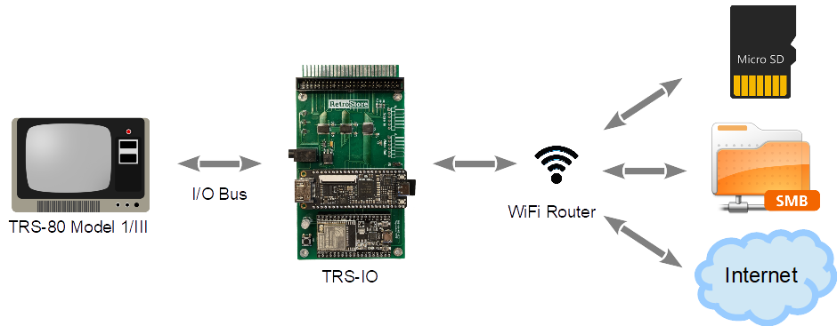

# TRS-IO

TRS-IO gives a TRS-80 Model III online capabilities and provides
access to a variety of services. TRS-IO currently features the
following capabilities:

1. Access to the <a href="https://retrostore.org">RetroStore</a>
2. <a href="http://frehd.com">FreHD</a> emulation
3. Access to files mounted on a SMB share
4. Access to remote servers via TCP

The following sections give an overview of TRS-IO as well as setup
instructions. This Github repository contains the complete source code
as well as the KiCad schematics for the PCB (Printed Circuit Board).
For the following descriptions it is assumed that an assembled TRS-IO
card is available.

### Overview

The figure below depicts the overall architecture. The TRS-80 machine
is connected to TRS-IO via the I/O Bus.  TRS-IO has a WiFi module that
connects to the local WiFi router. This allows TRS-IO to connect to
the Internet and access various services.




### Prerequisites

TRS-IO requires a TRS-80 Model III with 48 kB of RAM. Floppy disk
drives or a cassette tape are not required.  Note that the current
version of TRS-IO does not work with the TRS-80 Model I.


### Setting up TRS-IO

The following figure shows the top view of the TRS-IO card:


1. Push button
2. Red LED power indicator
3. Micro-USB connector
4. Multi-color status LED
5. TRS-80 I/O Bus connector

The TRS-IO card needs to be connected to the TRS-80 Model III's I/O
Bus via a 50-pin ribbon cable (5). Furthermore, the TRS-IO card needs
a separate power supply via a standard 5V USB charger. The micro-USB
connector (3) plugs into the side of the TRS-IO card. A small red LED
will indicate when a power supply is connected (2). The push button
(1) and the multi-color status LED (4) will be explained in the next
section.

Note: although it is possible to connect multiple cards to the
TRS-80's I/O Bus, not all cards are compatible.  In particular, the
popular <a href="http://frehd.com">FreHD</a> hard disk emulator is not
a good citizen on the I/O Bus as it takes over complete control. It is
therefore not possible to connect both <a
href="http://frehd.com">FreHD</a> and TRS-IO at the same time to I/O
Bus.


### Configuring TRS-IO

The core of the TRS-IO card is an ESP32 microcontroller that features
a WiFi module that is used to connect to a WiFi router. After
physically connecting the TRS-IO card to a TRS-80 Model III as
explained in the previous section, the WiFi module on the ESP32
microcontroller first needs to be be configured with the credentials
of the local WiFi network.

While in setup mode, the TRS-IO's status LED will continuously blink
in white to indicate that it has not yet been configured. While in
that mode, TRS-IO will create an open access point called
"TRS-IO". Use a laptop to connect to this WiFi network and then use a
browser to visit URL <a
href="http://trs-io.local">trs-io.local</a>. The following web page
should appear in the browser:


That web page can be used to configure SSID and password of the WiFi
network that TRS-IO should connect to, the local timezone as well as
the credentials of a SMB share. For open networks leave the WiFi
password field empty. Note that TRS-IO cannot connect to WiFi networks
that use a capture portal. The timezone as well as the SMB share are
not required but will result in limited functionality.

Once all the information is provided, click on submit to upload the
parameters. TRS-IO will automatically reboot and try to connect to the
specified WiFi network. If successful, the LED will turn green for a
few seconds. If the credentials are wrong or if the specified WiFi
network is not accessible, the LED light will turn permanently red.
Note that TRS-IO will store all parameters in its local flash memory,
so the setup only needs to be performed once. Once TRS-IO is connected
to a WiFi router, it should still be possible to access URL <a
href="http://trs-io.local">trs-io.local</a> from a browser on the same
WiFi network. Note, however, that some WiFi routers do not correctly
handle mDNS that is used to resolve <a
href="http://trs-io.local">trs-io.local</a>. In that case the IP
address that was assigned to TRS-IO can be used instead.

Pushing the button will make the LED flash twice. The first time for
the WiFi status (green: WiFi connected; red: WiFi not connected) and a
second time for the SMB status (green: connected to SMB share; red:
not connected to SMB share). With proper configuration parameters, the
LED should flash green twice. Holding down the push button for more
than three seconds will erase all configuration parameters and place
TRS-IO back into configuration mode (status LED flashing white). This
might be necessary if TRS-IO is moved to a different WiFi network.

The status LED indicates the state of TRS-IO:

* Blinking white: TRS-IO is not configured. It will create an open WiFi access point named "TRS-IO"
* Solid green: when TRS-IO has been configured with WiFi credentials and TRS-IO was able
  to connect to the WiFi network, the status LED will light in solid green for several seconds.
* Solid red: TRS-IO was configured with WiFi credentials but it was not possible to connect to the specified
  network. The reason could be wrong credentials or the specified network is itself offline. The push button can be
  used to reset TRS-IO into setup mode in case different credentials need to be provided.
* Solid blue: TRS-IO performs an OTA (Over-the-Air) update. TRS-IO will automatically detect
  newer firmware versions and will download and install the new firmware. The status LED will light solid blue during
  this process.
* Off: the status LED will be off during regular operations when TRS-IO is connected to the specified
  WiFi network and ready to accept commands from the TRS-80 Model III.
 
 ### Launching the native RetroStore Client

The <a href="https://retrostore.org">RetroStore</a> hosts applications
for the Tandy Radio Shack vintage computers and allows to seamlessly
download and run these applications without the need of cassettes or
floppy disks. TRS-IO acts as a gateway to the <a
href="https://retrostore.org">RetroStore</a>. This requires to run a
program on the TRS-80 that interfaces with TRS-IO. This program is
available as a regular <a
href="https://github.com/apuder/tpk/raw/master/src/main/resources/apps/rsclient/RSCLIENT.CMD">CMD</a>
executable.  For TRS-80 machines with attached physical floppy disks,
this CMD executable can be copied to a floppy disk and launched the
usual way. For TRS-80 machines that have neither floppy disk drives
nor cassette drives, it is also possible to bootstrap the native
client via the following short BASIC program:
 
 ```BASIC
 10 OUT236,16
 20 OUT31,3
 30 OUT31,1
 40 N=INP(31)+256*INP(31)
 50 FOR X=1 TO N:POKE20735+X,INP(31):NEXT
 RUN
 SYSTEM
 *? /20736
 ```
 
The above BASIC program will download the CMD executable from TRS-IO
and launch the native client.  Note that this procedure needs to be
repeated every time the TRS-80 is turned on.
 
### Using the native RetroStore Client

After successfully launching the native RetroStore client, the monitor
of the TRS-80 should look like this:
 

 
The screenshot above shows the main menu of the native RetroStore
client. The arrow indicates the currently selected menu item.  The up
and down cursor keys can be used to move between the various menu
items. Hitting the ENTER key will activate the currently selected
menu item. Pressing CLEAR or BREAK in sub-menus will return to the
previous menu.
 
Keyboard controls:
 
 * Cursor up/down: toggle menu selection
 * ENTER: select current menu selection
 * BREAK/CLEAR: exit to previous screen

### FreHD

TRS-IO is compatible with the popular <a
href="http://frehd.com">FreHD</a> hard disk emulator. While <a
href="http://frehd.com">FreHD</a> uses a SD card to store disk images,
TRS-IO accesses disk images that have to reside on a SMB share. Once
TRS-IO is configured to access a SMB share, simply copy the required
files such as <a
href="http://members.iinet.net.au/~ianmav/trs80/downloads.htm">FREHD.ROM</a>
to the SMB share. The IMPORT/EXPORT commands will access files on the
SMB share.
