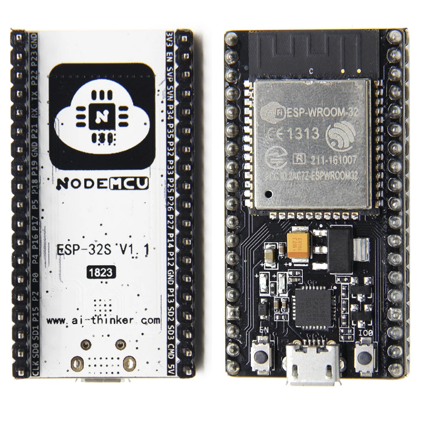
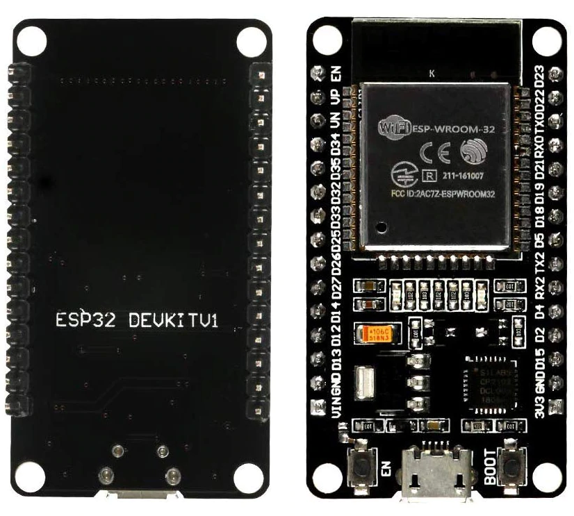
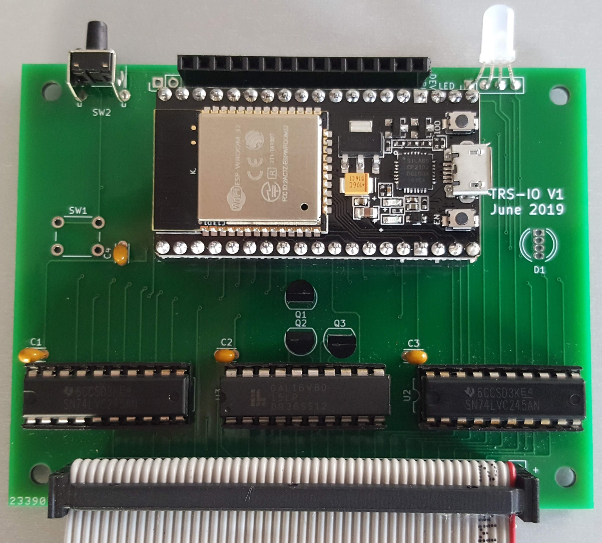
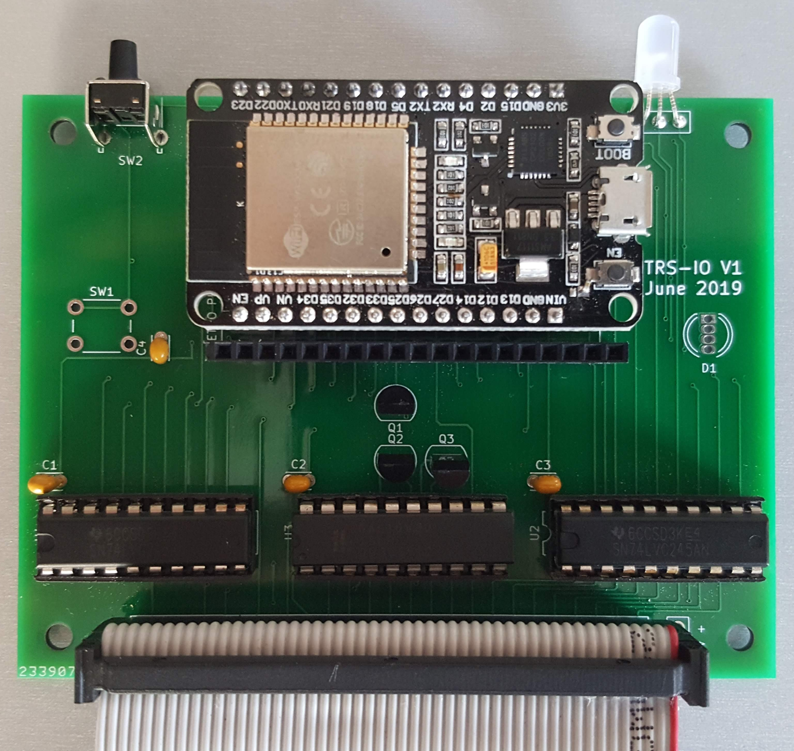

#### TRS-IO - Circuit Board Bill of Materials

|Qty|Ref|Digikey Part#|Manuf Part #|Description|
|:---|:---|:---|:---|:---|
|1|U1||ESP32 MODULE|Refer to Supported ESP32 Modules
|1|U3|[ATF16V8B-15PU-ND](https://www.digikey.com/product-detail/en/microchip-technology/ATF16V8B-15PU/ATF16V8B-15PU-ND/1118926)|ATF16V8B-15PU|IC PLD 8MC 15NS 20DIP
|2|U2,U4|[296-8503-5-ND](https://www.digikey.com/product-detail/en/texas-instruments/SN74LVC245AN/296-8503-5-ND/377483)|SN74LVC245AN|IC TXRX NON-INVERT 3.6V 20DIP
|3|Q1,Q2,Q3|[2N7000-G-ND](https://www.digikey.com/product-detail/en/microchip-technology/2N7000-G/2N7000-G-ND/4902350)|2N7000-G|MOSFET N-CH 60V 0.2A TO92-3
|1|D1|[1830-1014-ND](https://www.digikey.com/product-detail/en/inolux/HV-5RGB60/1830-1014-ND/7604616)|HV-5RGB60|LED RGB DIFFUSED 5MM T/H
|1|SW1|[450-1650-ND](https://www.digikey.com/product-detail/en/te-connectivity-alcoswitch-switches/1825910-6/450-1650-ND/1632536)|1825910-6|SWITCH TACTILE SPST-NO 0.05A 24V
|1|SW2||1825910-6|SWITCH TACTILE RIGHT-ANGLE SPST-NO 0.05A 24V
|3|U2,U3,U4|[ED3054-5-ND](https://www.digikey.com/product-detail/en/on-shore-technology-inc/ED20DT/ED3054-5-ND/4147598)|ED20DT|CONN IC DIP SOCKET 20POS TIN
|1|J1|[ED10530-ND](https://www.digikey.com/product-detail/en/on-shore-technology-inc/302-S501/ED10530-ND/2794241)|302-S501|CONN HEADER VERT 50POS 2.54MM
|1||[HDR100IMP40F-G-V-TH-ND](https://www.digikey.com/product-detail/en/chip-quik-inc/HDR100IMP40F-G-V-TH/HDR100IMP40F-G-V-TH-ND/5978200)|HDR100IMP40F-G-V-TH|SIL HDR 40POS 0.1 GOLD PCB
|4|C1,C2,C3,C4|[490-8809-ND](https://www.digikey.com/short/pvj15w)|RDER71E104K0P1H03B|CAP CER 0.1UF 25V X7R RADIAL
|3|R1,R2,R3|||100R 0.25W
|1|R4|||4K7 0.25W

#### Supported ESP32 Modules:
The TRS-IO board supports two commonly available ESP32 modules.

* 38 Pin Module commonly branded as NodeMCU or HiLetGo

* 30 Pin Module commonly branded as DEVKITV1

The pinout and spacing of the two modules differs.  Unless you plan to test your board with both modules, install 15 pin SIL sockets in 1st and 3rd positons for the 30 Pin Module or 19 pin SIL sockets in the 2nd and 4th positions for the 38 Pin Module.

Correct orientation of the modules is shown below:

* 38 Pin Module commonly branded as NodeMCU or HiLetGo

* 30 Pin Module commonly branded as DEVKITV1

#### Notes:
* The switch can be installed in either SW1 or SW2.  SW2 is recommended when assembling the board for installation in a case.
* The LED can be installed in either D1 or J4.  J4 is recommended when assembling the board for installation in a case.  Do not install an LED in both D1 and J4.
* R1,R2 and R3 are current limiting resistors for the LED.  The values are not critical and may require adjustment for some LED.
* The J5 header can be installed and jumpered to disable the internal FreHD emulation when an external FreHD is connected to the expansion connector.  J5 can be omitted if an external FreHD is not used.
* R4 is a pullup for the ESP32 FreHD Inhibit signal. This must always be installed even J5 is not.  Value is not critical.  Anything between 4K7 and 10K will work.
* 5V can be connected to J5 as an alternative to powering ESP32 from USB.  This is recommended when assembling the board for installation in a case.
