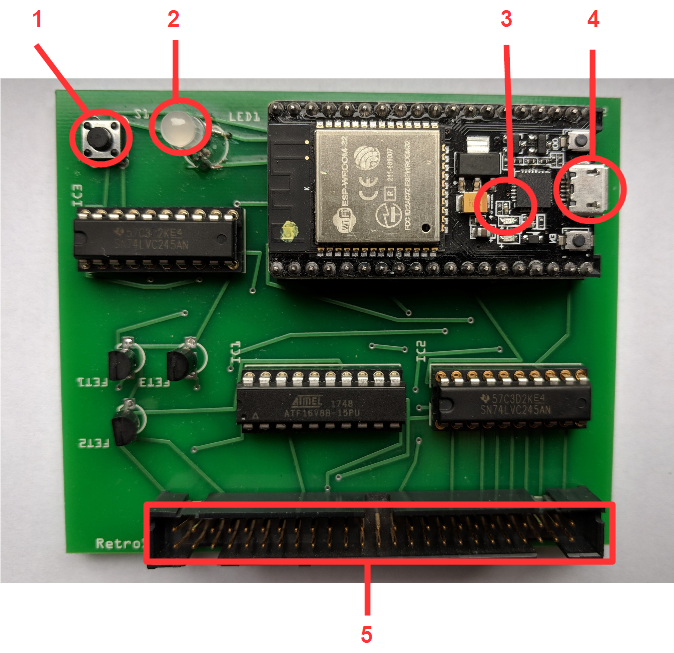
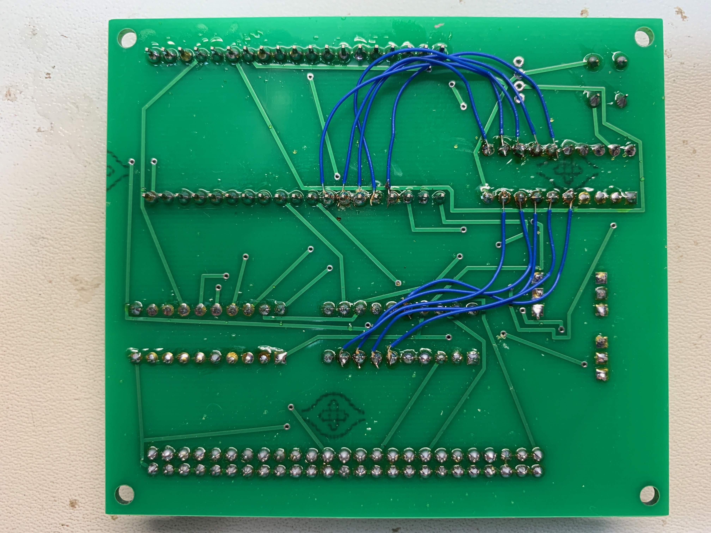

### RetroStoreCard Wiring Fix

If you have the original RetroStoreCard it can be made compatible with TRS-IO by adding a number of bodge wires.

The original RetroStoreCard looks like the one above.  If you have one of these, then you need to add the following wire connections to bring it up to spec with TRS-IO.

#### Wire Table

|From |To|
|:---|:---|
|ESP 23| IC3 15
|ESP 24| IC3 13
|ESP 25| IC3 14
|ESP 26| IC3 11
|ESP 27| IC3 12
|IC1 6| IC3 5
|IC1 7| IC3 7
|IC1 8| IC3 8
|IC1 9| IC3 9
|IC1 16| IC3 5

